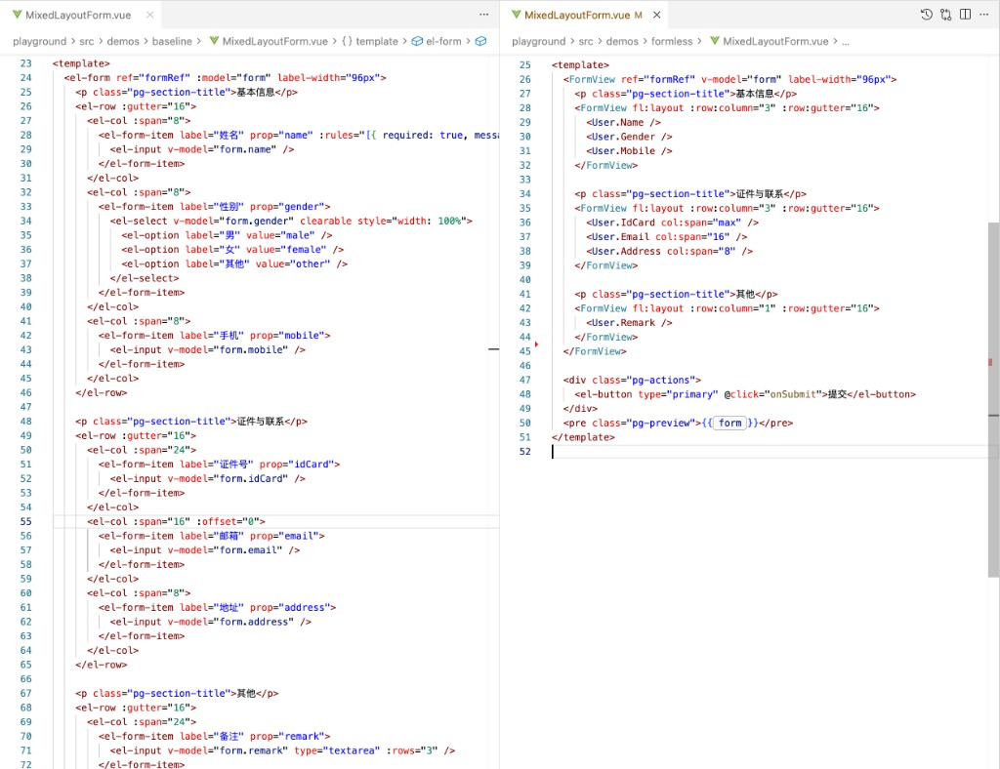
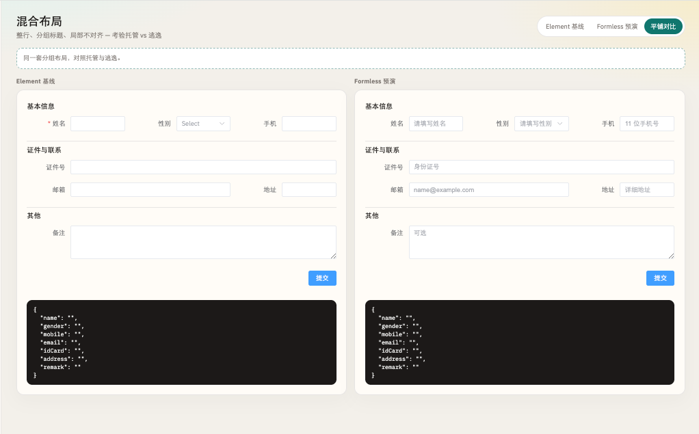

# vue-formless

English | [简体中文](./README.md)

> Vue 3 form library: a page-level control table plus FormView, with layout kept off the inputs. **0.1.1** — APIs may still change in 0.x.

Same mixed layout: Element Row/Col/Item on the left, `<User.*>` plus nested `FormView` density on the right.



Playground side by side (layout match):



```bash
pnpm add vue-formless
# or npm i vue-formless
```

Peer: `vue` ^3.3.

## Usage

Bind host Form / Item / Row / Col once in the project (no official Element adapter):

```ts
import { ElCol, ElForm, ElFormItem, ElInput, ElRow } from 'element-plus'
import { createFormControls, createFormView, resolveFormItemProp, type ItemFl } from 'vue-formless'

declare module 'vue-formless' {
  interface ControlSchema {
    label?: string
  }
}

export const FormView = createFormView({
  layout: { Row: ElRow, Col: ElCol, column: 2, gutter: 16 },
  form: {
    component: ElForm,
    props: (fl) => ({ model: fl.modelValue }),
  },
  item: {
    component: ElFormItem,
    props: (fl: ItemFl) => ({
      label: fl.label,
      prop: resolveFormItemProp(fl.binding, fl.controlKey),
    }),
  },
})

export const User = createFormControls({
  name: { label: 'Name', component: ElInput },
})
```

```vue
<FormView ref="formRef" v-model="form" fl:layout label-width="96px">
  <User.Name />
  <User.Name col:span="max" />
</FormView>
```

`validate()` / `resetFields()` go through the FormView ref (proxied host Form). Layout details: [docs/adr](./docs/adr/README.md).

## Live playgrounds

GitHub Pages (set **Settings → Pages → Source** to GitHub Actions; deploys from `main`):

- Forms: [https://xuyimingwork.github.io/vue-formx/](https://xuyimingwork.github.io/vue-formx/)
- 24-col layout: [https://xuyimingwork.github.io/vue-formx/layout/](https://xuyimingwork.github.io/vue-formx/layout/)

Local preview of the Pages bundle: `PAGES_BASE=/vue-formx/ pnpm build:pages`, then serve `site/`.

## Layout

```text
packages/vue-formless              # kernel (npm: vue-formless)
packages/layout                    # internal grid, bundled into the kernel
playground                         # Element Plus baseline vs Formless
playground-layout                  # 24-col layout studio
docs/adr                           # architecture decisions
```

## Development

```bash
pnpm i
pnpm dev          # playground
pnpm build        # library
pnpm test
pnpm typecheck
```

## License

[MIT](./LICENSE)
