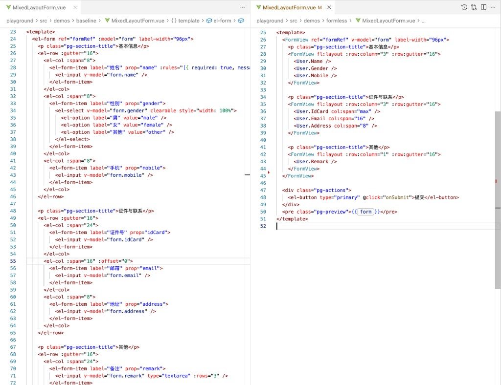
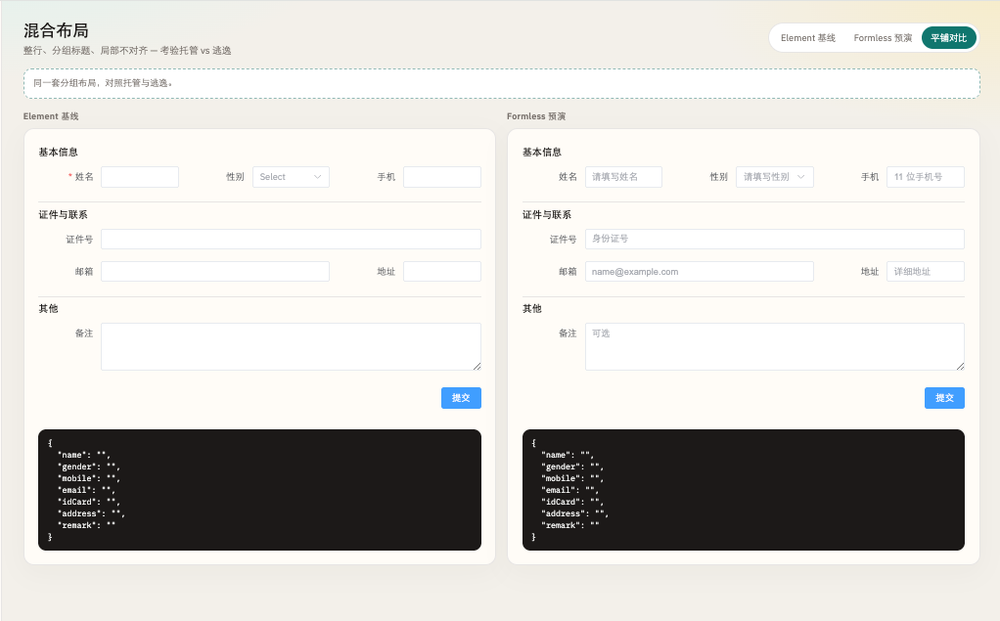

# vue-formless

English | [简体中文](./README.md)

> Vue 3 form library: a page-level control table plus FormView, with layout kept off the inputs. **0.2.0** — APIs may still change in 0.x.

Same mixed layout: Element Row/Col/Item on the left, `<User.*>` plus nested `FormView` density on the right.



Playground side by side (layout match):



```bash
pnpm add vue-formless
# or npm i vue-formless
```

Peer: `vue` ^3.3.

## Usage

Bind host Form / Item / Row / Col once in the project (no official Element adapter):

```ts
import { ElCol, ElForm, ElFormItem, ElInput, ElRow } from 'element-plus'
import { defineComponent, h, ref, type PropType } from 'vue'
import { createFormFields, createFormView, type FormFieldFormless } from 'vue-formless'

declare module 'vue-formless' {
  interface FormFieldCustomOptions {
    label?: string
  }
}

// ElFormItem `prop` speaks dot paths; the kernel location (`buyers[0].name`)
// is encoded here, in the adapter (design.md §20.9). One host `prop` cannot hold
// several ports, so such a field stays unbound (`undefined`) — use
// `fl:field="wrap-embed"` (one port per field) when the host must validate it.
function toItemProp(prop: FormFieldFormless['prop']): string | undefined {
  if (prop == null || prop.length !== 1) return undefined
  const [location] = prop
  if (location == null) return undefined
  const dotted = location.replace(/\[(\d+)\]/g, '.$1').replace(/^\./, '')
  if (!dotted || /[[\]]/.test(dotted)) return undefined // unencodable: leave unbound
  return dotted
}

// The no-prefix write model `modelValue` falls through to the host Form, but
// ElForm names its model port `model`: the adapter wraps it in a MyForm that
// maps the port and forwards ElForm's exposed instance methods (validate /
// resetFields) up to FormView's ref proxy. The factory no longer takes a
// functional `form.props`.
const MyForm = defineComponent({
  inheritAttrs: false,
  props: { modelValue: { type: [Object, Array] as PropType<unknown>, default: undefined } },
  setup(props, { attrs, slots, expose }) {
    const form = ref<Record<string, unknown> | null>(null)
    expose(new Proxy({}, {
      get: (_, key) => {
        const inner = form.value
        if (inner == null) return undefined
        const value = Reflect.get(inner, key, inner)
        return typeof value === 'function' ? value.bind(inner) : value
      },
      has: (_, key) => form.value != null && key in form.value,
    }))
    return () => h(ElForm, { ...attrs, ref: form, model: props.modelValue }, slots)
  },
})

export const FormView = createFormView({
  layout: { Row: ElRow, Col: ElCol, props: { column: 2 } },
  form: { component: MyForm },
  item: {
    component: ElFormItem,
    props: (fl: FormFieldFormless) => ({
      label: fl.label,
      prop: toItemProp(fl.prop),
    }),
  },
})

export const User = createFormFields({
  name: { label: 'Name', component: ElInput },
})
```

```vue
<FormView ref="formRef" v-model="form" fl:layout label-width="96px">
  <User.Name />
  <User.Name layout-item:span="max" />
</FormView>
```

`validate()` / `resetFields()` go through the FormView ref (proxied host Form). Layout details: [docs/adr](./docs/adr.md).

## Live playgrounds

GitHub Pages (set **Settings → Pages → Source** to GitHub Actions; deploys from `main`):

- Forms: [https://xuyimingwork.github.io/vue-formx/](https://xuyimingwork.github.io/vue-formx/)
- 24-col layout: [https://xuyimingwork.github.io/vue-formx/layout/](https://xuyimingwork.github.io/vue-formx/layout/)

Local preview of the Pages bundle: `PAGES_BASE=/vue-formx/ pnpm build:pages`, then serve `site/`.

## Layout

```text
packages/vue-formless              # kernel (npm: vue-formless)
packages/layout                    # internal grid, bundled into the kernel
playground                         # Element Plus baseline vs Formless
playground-layout                  # 24-col layout studio
docs/adr.md                        # architecture decisions (single doc)
```

## Development

```bash
pnpm i
pnpm dev          # playground
pnpm build        # library
pnpm test
pnpm typecheck
```

## License

[MIT](./LICENSE)
