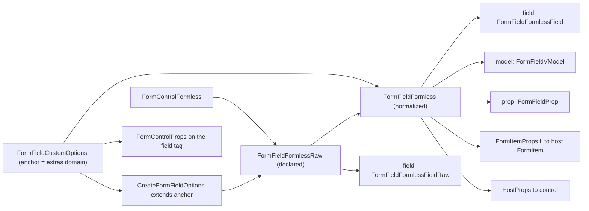

# ADR-022：类型体系（Scope 词表、Raw 两态与 `FormControl*` 前缀）

- **状态**：Accepted
- **日期**：2026-09-29
- **来源**：[ADR-015](./015-formless-config-groups.md) / [ADR-016](./016-fl-project-and-overlay.md) / [ADR-017](./017-composite-item-self.md) / [ADR-020](./020-form-view-cell-field.md) / [ADR-021](./021-channel-prefix-and-form-item.md)。本文钉**类型名怎么起**，不改运行时契约。

## 背景

词表在 ADR-020 / ADR-021 收束到 `FormView` / `FormField` / `FormItem` / `FormControl` 之后，类型名是**逐次改名长出来的**：`ControlConfig` → `ControlSchema` → `FieldSchema`，`ControlTagProps` / `ControlVModel` / `ControlProp` / `ControlFormless` / `FlExtraProps` / `FieldMode` 各写各的。于是同一个概念在类型面上有三种前缀（`Field*` / `Control*` / 裸 `ItemFl`），而「解析前」与「解析后」的两套形状没有统一区分手段。

本文把类型面按**从代码出发**重排一遍：先定命名法，再从代码里的解析点反推哪些键需要两态。

## 决策

### 1. 命名法

1. **每个名字 = 一个 Scope + 一个 Role。** Scope 只用四个概念词：`FormView` / `FormItem` / `FormField` / `FormControl`；`fl` 配置域另用 `Formless`。前缀写 Scope，后缀写 Role，例如 `FormFieldFormless`（FormField 的 formless 袋）、`FormControlFormless`（control 声明的 formless 袋）、`FormFieldProps`（FormField 的标签 props）、`FormItemProps`（宿主 Item 壳的 props）。
2. **Raw 判据：只有「解析前与解析后类型不同」才成对。** 解析后 = 原词（`<Name>`），解析前 = 原词 + `Raw`（`<Name>Raw`）。解析前后同型的概念**不新增名字**。
3. **`createXxx` 的入参一律 `Create<Xxx>Options`**（`CreateFormViewOptions` / `CreateFormFieldOptions` / `CreateFormItemOptions`）。
4. **`FormControl` 作为概念词不变**（= 被 FormField 渲染或包含的输入组件）；`FormControl*` 只是类型名前缀。**文档里的概念词不动**（见「消歧 ③」）。

| Scope | 类型名前缀 | 例 |
|-------|-----------|-----|
| `FormView` | `FormView*` | `FormViewProps` / `FormViewComponent` / `CreateFormViewOptions` / `FormViewLayoutProp`（私有） / `FormViewFormProp`（私有） / `FormViewContext` |
| `FormItem` | `FormItem*` | `FormItemProps` / `FormItemComponent` / `CreateFormItemOptions` / `FormFieldContext.FormItem` |
| `FormField` | `FormField*` | `FormFieldProps` / `FormFieldComponent` / `FormFieldSlotProps` / `FormFieldContext` / `FormFieldFormless(Raw)` / `FormFieldFormlessField(Raw)` / `FormFieldVModel(Raw)` / `FormFieldProp(Raw)` / `FormFieldCustomOptions`（锚点，也是 extras 域本身）/ `FormFieldCustomTagProps`（extras → `fl:*`） |
| `FormControl` | `FormControl*` | `FormControlFormless` / `FormControlProps` |
| `Formless` | `HostProps` 等通用 | `HostProps` / `Channel` 全家 / path 全家 / `ValueSource` 全家 |

通用推断（`ComponentPublicProps` / `LockedVModelKeys`）与 FormControl 无关，保持原名。

### 2. Raw 判据的来源：代码里的解析点

判据不是「参数化就成对」，而是逐点读出来的：

| 键 | 解析点 | 解析前 → 解析后 | 成对？ |
|----|--------|----------------|--------|
| 整袋 `fl` | `{ ...preset.fl, ...fl }` → `FormFieldCore` 的 `formless` | 全可选 + 开放索引签名 → 四键定型 + 锚点声明的 extras（快照不再开放） | ✅ `FormFieldFormlessRaw` / `FormFieldFormless` |
| `model` | `normalizeModel` | `string \| readonly string[]` → `(string \| undefined)[]` | ✅ `FormFieldVModelRaw` / `FormFieldVModel` |
| `prop` | `normalizeProp` | `string \| readonly string[]` → `(string \| undefined)[]` | ✅ `FormFieldPropRaw` / `FormFieldProp` |
| `field` | `FormFieldCore` 的 `field` computed | `'auto' \| 'embed' \| 'wrap-embed'` → `'wrap' \| 'embed' \| 'wrap-embed'` | ✅ `FormFieldFormlessFieldRaw` / `FormFieldFormlessField` |
| `item` | `getAttrBoolean(true, 页 fl:item, 格 fl.item)` | `boolean` → `boolean` | ❌ 同型，**不新增名字** |
| `name` | `createFormFields` 注入 | `string` → `string`（且**不进 `fl` 袋**） | ❌ |
| path | `parsePath(string)` | 输入本就是裸 `string` | ❌ |

**`item` 为什么不成对**：它在类型面**进出都是 `boolean`**——签名 `getAttrBoolean(true, …)` 的种子是 `true`，返回值必为 `boolean`，不是 `boolean | undefined`。只有运行时裸 attr（`''`）才是第三种形态，那属于 DOM attr 语义、由 `getAttrBoolean` 承担，不是这个键的第二个类型状态。为此给 `getAttrBoolean` 加了重载：

```ts
export function getAttrBoolean(seed: boolean, ...values: unknown[]): boolean
export function getAttrBoolean(...values: unknown[]): boolean | undefined
```

带 `boolean` 种子的调用点结果收窄成 `boolean`，`FormFieldFormless.item: boolean` 才标得上去——这正是此前 `as unknown as FormFieldFormless` 盖住的东西。

`field` 的两态用**嵌套锚点**命名（`FormFieldFormlessFieldRaw` / `FormFieldFormlessField`），而不是 `FormFieldMode`：位置这个词属于 `formless` 袋的一部分（`FormFieldFormless.field`），名字要能顺着读出来；`FormFieldVModel*` / `FormFieldProp*` 同理（scope = FormField，不是 Control——它们描述的是**这一格**的绑定，不是 control 自身的属性）。

### 3. 单一锚点：`FormFieldCustomOptions` 与 `CreateFormFieldOptions`

原来的三件套——module augmentation 锚点 `FieldSchema`、工厂入参 `FieldSchemaInput`、内部已解析形态 `FieldFactoryInput`——其实是**同一个形状**：`component` / `props` / `model` / `prop` / `item` / `field` + `name` + extras。合并为 `interface CreateFormFieldOptions`，并把**可增强的 extras 域单独提成锚点** `FormFieldCustomOptions`——锚点即 extras 域，不再有 `Omit` 派生的第二个名字：

```ts
// 与 Vue 原生 ComponentCustomOptions 同形：空接口 + declare module 增强
export interface FormFieldCustomOptions {}

export interface CreateFormFieldOptions extends FormFieldCustomOptions {
  component?: unknown
  props?: HostProps<FormFieldFormless>
  model?: FormFieldVModelRaw
  prop?: FormFieldPropRaw
  item?: boolean
  field?: FormFieldFormlessFieldRaw
  name?: string
}
```

- `FormFieldCustomOptions` 是**唯一的 `declare module 'vue-formless'` 锚点**（只放 extras），**同时也是 extras 域本身**：消费者在它上面声明 `label` / `validation`，`CreateFormFieldOptions extends` 把 extras 并进工厂入参的形状；而 `FormFieldFormless` 直接 `extends FormFieldCustomOptions`、标签 props 直接 `FormFieldCustomTagProps<FormFieldCustomOptions>`——extras 不经任何中间别名。`extends` 能吸纳全局增强成员，与 `ComponentOptionsBase extends ComponentCustomOptions` 是同一手法。
- extras 域**不另起名字**（这是 §1 命名法第 2 条「解析前后同型的概念不新增名字」的直接推论）：`FormFieldCustomOptions` 与 `CreateFormFieldOptions` 解析前后同型的那部分就是 extras 本身。曾经的 `FormFieldExtras = Omit<CreateFormFieldOptions, FormFieldKernelKeys>`（及 `FormFieldKernelKeys`）与 `CreateFormFieldOptions` 的键集靠手工同步——加内核键却漏改 `FormFieldKernelKeys` 时，该键会**静默**漏进快照与 `fl:*` 标签 props；合并后这类漂移不可能发生。
- `CreateFormFieldOptions` 是 `createFormField` / `createFormFields` 每一项的入参（内核键 + 锚点带来的 extras）。
- `component` 保持 `unknown`（而非 `Component`）：域表要能透传任意输入，并让标签侧推断出该输入自己的公开 props。
- `FormFieldFormlessRaw` 用 `Omit<CreateFormFieldOptions, 'name'>`：`name` 是工厂私有（调试组件名），不进 `fl` 袋。

### 4. 快照闭环：去掉四处断言里的三处

命名统一之后，`FormFieldCore → FormItem` 的交接可以两侧同名：

- `assembly/create-form-item.tsx` 新增 `FormItemProps`（`{ fl: FormFieldFormless; item: Record<string, unknown> }`）与 `FormItemComponent = DefineComponent<FormItemProps>`；`fl` prop 声明为 `FormFieldFormless`，删掉 `props.fl as unknown as FormFieldFormless`。
- `shared/injection-keys.ts`：`FormFieldContext.FormItem?: FormItemComponent`（原为 `Component`，交接不过编译期检查）。
- `assembly/create-form-field.tsx`：`formless` computed 标注 `FormFieldFormless`、`field` computed 标注 `FormFieldFormlessField`，删掉 `preset.props(formless.value as any)`——**只加注解不标注等于没闭环**，断言必须删。
- `assembly/create-form-view.tsx`：`const FormItem: any = createFormItem(...)` 去掉 `: any`。

明确**范围外**（保持现状）：`create-form-field.tsx` 的 `(props.fl?.component as any)?.formless`、`(context as any)`、`use-form-view-value.ts` 的 `as any`、`Control` 上的 `as unknown as JsxHost`——这些断言覆盖的是 Vue 组件联合类型与递归上下文，不属于本次快照闭环。

### 5. 顺带清理

- `shared/props-overlay.ts`（`resolveProps` / `mergeAttrs`）无运行时调用点，各组件已内联展开 → 删除（含测试）。
- `shared/utils.ts` 的 `omit` 无调用点 → 删除（含用例）。
- `JsxHost` 内核只留一份，放 `shared/utils.ts`；`create-form-field.tsx` / `create-form-view.tsx` / `create-form-item.tsx` 改为导入。**不从 `@vue-formless/layout` 引**（layout 那份是它自己的），保持内核私有。

## 消歧

### ① `FormControlProps` 与历史同名

[ADR-015](./015-formless-config-groups.md)（第 6 行）与 [ADR-017](./017-composite-item-self.md)（第 133 行）里的 `FormControlProps` 指**内核字段自己的 props**，也就是今日的 **`FormFieldProps`**。

今日的 `FormControlProps<Def>` 是**另一个东西**：control 标签的**公开 props**，由被渲染的 control 反推、再剥掉 v-model 口（`LockedVModelKeys`）：

```ts
export type FormControlProps<Def> = Def extends { component?: infer C }
  ? [Exclude<C, undefined>] extends [never] ? {} : Omit<ComponentPublicProps<...>, LockedKeysForDef<Def>>
  : {}
```

两篇 ADR 的正文按「历史正文不改」保留，各自顶部修订小节已注明同名的两义。

### ② `FormFieldCustomOptions` 与 Vue 原生 `ComponentCustomOptions`

`FormFieldCustomOptions` 是 module augmentation 的**锚点**——故意与 Vue 自带的 `ComponentCustomOptions` 同形（空接口 + `declare module` 增强）：声明 `label` / `validation` 等 extras，`CreateFormFieldOptions extends FormFieldCustomOptions` 把 extras 并进工厂入参，再流进快照与标签。

`ComponentCustomOptions` 是 **Vue 自带的**全局增强接口，本项目只用来声明 control 的静态 `formless` 袋（`declare module 'vue' { interface ComponentCustomOptions { formless?: FormControlFormless } }`）。

两者名字里的 `CustomOptions` 与「空接口 + 增强」的手法都是刻意对齐（一个扩 control，一个扩 field），但作用域不同：一个挂在 Vue 组件选项上，一个挂在字段声明上。

extras → `fl:*` 的**键名映射**是另一个（私有）类型 `FormFieldCustomTagProps<T>`（`label` → `'fl:label'`，原 `FormFieldCustomOptions<T>`）——它与锚点同域，但职责是「映射」而非「增强」，故不再叫 `CustomOptions`。

### ③ `FormControl*` 只作类型前缀

`FormControl` 作为**概念词**仍是「被 FormField 渲染或包含的那颗输入组件」——设计文档里出现的 `control` 不改写、不替换。`FormControlFormless` / `FormControlProps` 只是把这类类型的 Scope 前缀统一到四个概念词上，避免与 `FormField*` 混用。

## 数据流（同一套词表贯穿）



## 后果

- **公开 breaking**（0.x）：module augmentation 锚点从 `CreateFormFieldOptions` 改为 **`FormFieldCustomOptions`**（`CreateFormFieldOptions` 仍是工厂入参，但改由 `extends FormFieldCustomOptions` 获得 extras）；`FieldSchema` / `FieldSchemaInput` / `FieldFactoryInput` 三合一为 `CreateFormFieldOptions`；旧泛型映射 `FormFieldCustomOptions<T>`（原 `FlExtraProps<T>`）改名 `FormFieldCustomTagProps<T>`；`ControlFormless` → `FormControlFormless`；且 `FormFieldVModel*` 放宽为 `string | readonly string[]`（`as const` 数组现在可直接写入 `model` / `prop` / `fl:model` / `fl:prop`）。
- 类型面只导出「不给名字就用不了」的那些（见 [`design.md`](../design.md) §19）：`FormFieldCustomOptions`（augmentation 锚点，也是 extras 域）/ `CreateFormFieldOptions` / `FormControlFormless` / `FormFieldFormless` + 组件 props 契约；派生类型（`FormFieldFormlessRaw`、`FormFieldFormlessFieldRaw` / `FormFieldFormlessField`、`FormFieldVModelRaw` / `FormFieldVModel`、`FormFieldPropRaw` / `FormFieldProp`、`FormFieldCustomTagProps`、`HostProps`）保持私有，经索引访问可达。
- `FormFieldExtras` / `FormFieldKernelKeys` 退场——两者从未公开，无公开影响。extras 域由锚点 `FormFieldCustomOptions` 直接承担（§3），`CreateFormFieldOptions` 只留内核键；`field-schema.test.ts` 里原来的 `expectTypeOf<FormFieldExtras>().toEqualTypeOf<{}>()` 改判锚点（未增强时为空）。
- 快照交接不再靠断言；`field` / `model` / `prop` 的两态边界由 `field-schema.test.ts` 的编译期断言钉住（`'auto'` 只在 Raw 侧；`FormFieldFormlessRaw['model']` ≠ `FormFieldFormless['model']`）。
- `create-form-fields` / `create-form-view` 的公开签名不变；`NamespacedFields<S>` 的条目类型随锚点改名。
